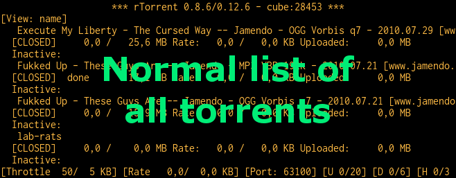
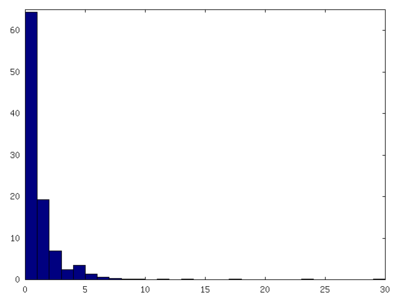

.. included from usage.rst

.. _condition-examples:
.. _useful-filter-conditions:

Useful Filter Conditions
^^^^^^^^^^^^^^^^^^^^^^^^

The following :ref:`rtcontrol` :ref:`filter-conditions` give you a hint on what you can do, and some
building blocks for more complex conditions.

``*HDTV*``
    Anything with "HDTV" in its name

``/s\d+e\d+/``
    Anything with typical TV episode numbering in its name (regex match)

``ratio=+1``
    All downloads seeded to at least 1:1

``xfer=+0``
    All active torrents (transferring data)

``up=+0``
    All seeding torrents (uploading data)

``down=+0 down=-5k``
    Slow torrents (downloading, but with < 5 KiB/s)

``down=0 is_complete=no is_open=yes``
    Stuck torrents

``size=+4g``
    Big stuff (DVD size or larger)

``is_complete=no``
    Incomplete downloads

``is_open=y is_active=n``
    Paused items

``is_ghost=yes``
    Torrents that have no data (were never started or lost their data; *since v0.3.3*)

``alias=obt``
    Torrents tracked by `openbittorrent.com` (see :doc:`setup` on how to add aliases for trackers)

``'path=!'``
    Has a non-empty `path`

``ratio=+1 realpath=\!/mnt/*``
    1:1 seeds not on a mounted path (i.e. likely on localhost)

``completed=+2w``
    Completed more than 2 weeks ago (*since v0.3.4*)

``tagged=``
    Not tagged at all (*since v0.3.5*)

``tagged=\!``
    Has at least one tag (*since v0.3.5*)

``tagged=foo,bar``
    Tagged with "foo" or "bar" (*since v0.3.5*) — tags are white-space separated
    lists of names in the field ``custom_tags``

``tagged==highlander``
    *Only* tagged with "highlander" and nothing else (*since v0.3.6*)

``kind=flac,mp3``
    Music downloads (*since v0.3.6*)

``files=sample/*``
    Items with a top-level `sample` folder (*since v0.3.6*)

``ratio=+2.5 OR seedtime=+1w``
    Items seeded to 5:2 **or** for more than a week (*since v0.3.6*)

``alias=foo [ ratio=+2.5 OR seedtime=+7d ]``
    The same as above, but for one tracker only (*since v0.3.7*)

``traits=avi traits=tv,movies``
    TV or movies in AVI containers (*since v0.3.7*)

Note that the ``!`` character has to be escaped in shell commands. For a
current full list of all the field names and their meaning, see the
output of the ``--help-fields`` option of :ref:`cli-usage-rtcontrol`
which gives you a complete list for your installation.

Integrating ‘rtcontrol’ into the Curses UI
^^^^^^^^^^^^^^^^^^^^^^^^^^^^^^^^^^^^^^^^^^

Anyone who ever dreamt about a `search box <http://www.youtube.com/watch?v=y8gHEfA1w3Y>`_
in their rtorrent UI, dream no more...

.. note::

    You already have the following configuration commands,
    if you followed the :doc:`setup`.

Just add this to your ``.rtorrent.rc``:

.. code-block:: ini

    # VIEW: Use rtcontrol filter (^X s=KEYWORD, ^X t=TRACKER, ^X f="FILTER")
    method.insert = s,simple|private,"execute.nothrow=rtcontrol,--detach,-qV,\"$cat=*,$argument.0=,*\""
    method.insert = t,simple|private,"execute.nothrow=rtcontrol,--detach,-qV,\"$cat=\\\"alias=\\\",$argument.0=\""
    method.insert = f,simple|private,"execute.nothrow=rtcontrol,--detach,-qV,$argument.0="

You can of course add as many commands as you like, and include sorting
options and whatever else ``rtcontrol`` offers.

The 'trick' here is the ``-V`` (``--view-only``) option, which shows the
selection result in a rTorrent view instead of on the console. You can
add this to any query you execute on the command line, and then
interactively work with the result. The above commands are just
shortcuts for common use-cases, directly callable from the curses UI.

Reports
^^^^^^^

Using bash Aliases for Common Reports
"""""""""""""""""""""""""""""""""""""

You might want to add the following alias definitions to your
``~/.bashrc``:

.. code-block:: bash

    alias rt2days="rtcontrol -scompleted -ocompleted,is_open,up.sz,ratio,alias,name completed=-2d"
    alias rtls="rtcontrol -qo '{{chr(10).join([d.directory+chr(47)+x.path for x in d.files])|h.subst(chr(47)+chr(43),chr(47))}}'"

``rt2days`` gives the completion history of the last 48 hours,
and ``rtls`` lets you create lists of files just like ``ls``:

.. code-block:: bash

    $ rtls /a.boy/ | xargs -d'\n' ls -lgGh
    -rw-r----- 1 702M Mar  7 17:42 /var/torrent/work/A_Boy_and_His_Dog.avi

If you feed the list of paths into normal ``ls`` as shown,
you have all the usual options available to you.

.. note::

    See the
    `rt-alias.sh <https://github.com/pyroscope/pimp-my-box/blob/master/roles/pyroscope-cli/files/profile.d/rt-alias.sh>`_
    file of the `pimp-my-box <https://github.com/pyroscope/pimp-my-box/>`_ project
    for these and some more aliases.

Defining and Using Custom Output Formats
""""""""""""""""""""""""""""""""""""""""

Before describing the possible options for output formatting in more
details below, here's a short overview of the possible methods, each
with an example:

  * ``size.sz,name`` — simple field lists, possibly with
    format specifiers; in the output, fields are separated by a TAB character.
  * ``%(size.sz)s %(name)s`` — string interpolation, i.e. like the above
    lists, but interspersed with literal text instead of TABs.
  * ``{{d.size|sz}} {{d.name}}`` — Tempita templates, see :ref:`output-templates`
    for more details.
  * ``file:template.tmpl`` — File URLs that point to a
    template file, which is especially useful for more complicated
    templates. The filenames can be absolute (starting with a ``/``),
    relative to your home (starting with a ``~``), or relative to
    ``templates`` in the configuration directory (anything else).
  * ``«formatname»`` — A name of a custom format from the ``[FORMATS]``
    configuration section, see ``~/.pyroscope/config.ini.default`` for the
    predefined ones (including the special ``default`` format).

Starting with version 0.3.5, you can define custom output formats and
print column headers, the ``rt2days`` example from the previous section
becomes this:

.. code-block:: bash

    alias rt2days="rtcontrol --column-headers -scompleted -ocompletion completed=-2d"

You need to define the custom output format used there, so also add this
to your ``~/.pyroscope/config.ini``:

.. code-block:: ini

    [FORMATS]
    # Custom output formats
    completion = $(completed.raw.delta)13.13s $(leechtime)9.9s $(is_open)4.4s $(up.sz)10s/s $(ratio.pc)5d$(pc)s $(alias)-8s $(kind_50)-4.4s  $(name)s

See `PyFormat <https://pyformat.info/>`_
for a description how the formatting options work, and notice that ``$``
is used instead of ``%`` here, because ``%`` has a special meaning in
INI files. For the same reason, a single ``%`` in the final output
becomes ``$(pc)s`` in the configuration (``pc`` is a system field that
is simply a percent sign).

You can also append one or more format specifiers to a field name,
separated by a ``.``. These take the current value and transform it —
in the above example ``.raw.delta`` means "take an unformatted time
value and then convert it into a time delta relative to just now." The
option ``--help-fields`` lists the available format specifiers.

Then, calling ``rt2days -q`` will print something like this::

     COMPLETED LEECHTIME IS_O         UP/s RATIO% ALIAS    KIND  NAME
    1d 21h ago   10m  2s  OPN    0 bytes/s   100% SeedBox  rar   lab-rats

And with version 0.3.6 installed, you can create a full listing of all
the files you have loaded into rTorrent using the predefined format
"``files``"::

    $ rtcontrol \* -ofiles | less
    STP    1970-01-01 01:00:00   25.6 MiB Execute My Liberty - The Cursed Way -- Jamendo - OGG Vorbis q7 - 2010.07.29 [www.jamendo.com] {Jamendo}
           2010-08-21 01:25:27    2.0 MiB | 01 - Midnight (Intro).ogg
           ...
           2010-08-21 01:25:27   48.7 KiB | [cover] Execute My Liberty - The Cursed Way.jpg
                                          = 9 file(s) [ogg txt]
    ...

And finally, from version 0.4.1 onwards, you can use a full templating
language instead of the simple field lists or string interpolation
described above, more on that in :ref:`output-templates`.

Statistics
^^^^^^^^^^

Printing Some Statistics to the Terminal
""""""""""""""""""""""""""""""""""""""""

Create a list of all your trackers and how many torrents are loaded for
each:

.. code-block:: bash

    rtcontrol -q -o alias -s alias \* | uniq -c

You can easily modify this by using conditions other than ``*``, e.g. show the
count of fully seeded downloads using ``ratio=+1``. Or try the same command with
``traits`` instead of ``alias`` (version 0.3.7 only).

The total amount of data you have loaded in GiB:

.. code-block:: bash

    rtcontrol -qosize \* | awk '{ SUM += $1} END { print SUM/1024/1024/1024 }'

The amount uploaded per tracker:

.. code-block:: bash

    rtcontrol -qo alias,uploaded // \
        | awk '{arr[$1]+=$2} END {for (i in arr) {printf "%20s %7.1f GiB\n",i,arr[i]/1024^3}}' \
        | sort -bnk2

Starting with version 0.4.1, you can also request a statistical summary
of your numerical output columns, like this::

    $ rtcontrol -qo size.sz,uploaded.sz,ratio.pc --summary "a*"
          SIZE	  UPLOADED	RATIO
      14.5 GiB	   9.3 GiB	2592.0 [SUM of 32 item(s)]
     462.4 MiB	 298.9 MiB	81.0 [AVG of 32 item(s)]

Normalized Histogram of Ratio Distribution
""""""""""""""""""""""""""""""""""""""""""

The following will create a normalized histogram of ratio distribution
of your loaded torrents. Each bar indicates the percentage of items in a
ratio class (i.e. the first bar shows ratios up to 1).

.. code-block:: bash

    rtcontrol alias=* -qo ratio -s ratio >/tmp/data \
        && octave -q --persist --eval \
                  "load /tmp/data; hist(data, $(tail -n1 /tmp/data), 100); print -dpng /tmp/ratio.png"

You need to have `Octave <http://www.gnu.org/software/octave/>`_
installed, on Debian/Ubuntu all you need is
``sudo aptitude install octave3.0``.

Performing Management Tasks
^^^^^^^^^^^^^^^^^^^^^^^^^^^

Fixing Items With an Empty "Base Path"
""""""""""""""""""""""""""""""""""""""

Sometimes rTorrent loses track of where it stores the data for an item,
leading to an empty ``Base path`` in the ``Info`` panel. You can try to
fix this by selectively rehashing those, with these commands:

.. code-block:: bash

    rtcontrol path= is_complete=y -V
    rtcontrol path= is_complete=y --hash -i

The first command selects the broken items into a rTorrent view, so that
you can watch the progress of hashing and the results afterwards. If all
of them are finished, you can then start those that were successfully
restored like so:

.. code-block:: bash

    rtcontrol path=\! done=100 --from-view rtcontrol --start``

(note that the ``--from-view`` option needs version 0.3.7)

Deleting Download Items and Their Data
""""""""""""""""""""""""""""""""""""""

Using the option ``--cull`` of version 0.3.10, an item can be deleted
including its data. You can do this either manually, or automatically as
a part of ratio management (see the section further below on that
topic).

Called from the shell, you will first be presented with the number of
items found and then asked for each of them whether you want to delete
it (interactive mode is on by default). Therefor, for automatic uses in
cron, you should also specify the ``--yes`` option.

If you define the following command shortcut, you can also delete the
current item directly from ncurses (needs version 0.4.1 to work):

.. code-block:: ini

    method.insert = cull,simple|private,"execute.nothrow=rtcontrol,-q,--detach,--cull,--yes,\"$cat=hash=,$d.hash=\""

Just select the item you want to annihilate and enter ``cull=`` into the
command prompt (``Ctrl-X``).
Note that *you already have that command added* if you followed the :doc:`setup`.

Pruning Partial Downloads
"""""""""""""""""""""""""

Starting with version 0.3.10, the ``--purge`` option (a/k/a
``--delete-partial``) allows you to not only delete the selected items
from the client, but at the same time delete any incomplete files
contained in them (i.e. files that are part of an incomplete chunk).

For technical reasons, rTorrent has to create files that you have
deselected from download to save data of chunks that border selected
files, and this option can be a great time saver, especially on large
torrents containing hundreds of files. So, unless you have filtered out
incomplete items by the appropriate conditions, using ``--purge``
instead of ``--delete`` is always the better option.

As with ``--cull``, a shortcut command to call this from the curses UI
is useful:

.. code-block:: ini

    system.method.insert = purge,simple,"execute_nothrow=rtcontrol,-q,--detach,--purge,--yes,\"$cat=hash=,$d.get_hash=\""

Note that *you already have that command added* if you followed the :doc:`setup`.

Performing Periodic Tasks
^^^^^^^^^^^^^^^^^^^^^^^^^

Simple Queue Management
"""""""""""""""""""""""

This is a queue management one-liner (well, logically one line). Before
you run it automatically, add a trailing "-n" to test it out, e.g. play
with the queue size parameter and check out what would be started. Then
put it into a script, crontab that and run it every (few) minute(s).

.. code-block:: bash

    export rt_max_start=6; rtcontrol -q --start --yes hash=$(echo $( \
        rtcontrol -qrs is_active -o is_open,hash is_complete=no is_ignored=no \
        | head -n $rt_max_start | grep ^CLS | cut -f2 ) | tr " " ,)

It works by listing all incomplete downloads that heed commands and
sorting the already active ones to the top. Then it looks at the first
``rt_max_start`` entries and starts any closed ones.

Note that this means you can exempt items from queue management easily
by using the ``I`` key in the curses interface. See :ref:`QueueManager` for a
much better solution.

Move on Completion
""""""""""""""""""

The following moves completed downloads *still physically residing* in a
``work`` directory (change the ``realpath`` filter when you named your
download directory differently), to another directory (note that you can
restrict this further, e.g. to a specific tracker by using
"alias=NAME"). You don't need any multiple watch folders or other
prerequisites for this.

.. code-block:: bash

    rtcontrol --from-view complete 'realpath=*/work/*' -qo '~/bin/rtmv "$(path)s" ~/rtorrent/done --cron' | bash

Test it first **without the** ``| bash`` **part** at the end, to make sure
it'll in fact do what you intended.

Another advantage is that in case you ever wanted to switch clients, or
exchange the drive you host the data on, you can do so easily since all
the active downloads still reside at one place in your download
directory (in form of a bunch of symlinks) — even if their data is
scattered all over the place in reality.

You can also extend it to create more organized completion structures,
e.g. creating a directory tree organized by month and item type, as
follows::

    RT_SOCKET=/home/bt/rtorrent/.scgi_local

    # Move completed torrents to "done", organized by month and item type (e.g. "2010-09/tv/avi")
    */15    * * * *         test -S $RT_SOCKET && ~/bin/rtcontrol --from-view complete 'realpath=*/work/*' -qo '~/bin/rtmv "$(path)s" ~/rtorrent/done//$(now.iso).7s/$(traits)s --cron' | bash

The above is a fully working crontab example, you just have to adapt the paths to your system.
If you want to create other organizational hierarchies, like "by tracker",
just replace the ``$(now.iso).7s/$(traits)s`` part by ``$(alias)s``.
And if you don't want the file type in there (i.e. just "tv"),
use ``$(traits.pathdir)s`` to have it removed.

To get themed trackers specially treated, you can add hints to the
``[TRAITS_BY_ALIAS]`` section of the config (see ``config.ini.default``
for examples).

Afterwards, you can always move and rename stuff at will
*and still continue seeding*, by using the ``rtmv`` tool in version 0.3.7 ­— this
will rename the data file or directory at its current location and
automatically fix the symlink in the download directory to point at the
new path. Example:

.. code-block:: bash

    cd ~/rtorrent/done/2010-09/tv/avi
    rtmv foo.avi bar.avi

Ratio Management
""""""""""""""""

While rTorrent has a built-in form of ratio management since a few
versions, it's hard to use after-the-fact and also hard to understand —
you need to have different watch directories and complex settings in
your ``.rtorrent.rc`` to use that.

It can be much simpler — a basic form of ratio management using ``rtcontrol`` looks like this:

.. code-block:: bash

    rtcontrol is_complete=yes is_open=yes ratio=+1.1 alias=sometracker,othertracker --stop

You will always want to have the
``is_complete=yes is_open=yes ratio=+1.1`` part, which excludes all
torrents that are still downloading, closed or not having the necessary
ratio. Another basic filter is ``is_ignored=no``, which excludes items
that have their *ignore commands* flag set (via the ``I`` key) from
ratio management.

To that you can add anything you think fits your needs, and also use
several commands with different minimum ratios for different trackers by
selecting them using ``alias`` or ``tracker``, like in the example
above. Assuming you have your original seeds in a directory named
``seed`` and don't want to ratio-limit them, one thing you might add is
``'datapath=!*/seed/*'`` to prevent them from being stopped. Only your
imagination (and the available fields) are the limit here.

If you then put these commands into a script that runs every few minutes
via ``cron``, you have a very flexible form of ratio management that can
be changed on a whim.

.. note::

    For cron use, you'll want to add the ``--cron --yes`` options to
    any ``rtcontrol`` commands. The first one redirects logging to
    a special logfile ``~/.pyroscope/log/cron.log``,
    and the second positively answers any prompts that would appear
    when using ``--delete`` or ``--cull``.

To complete your command line, you add the action you want to take on
the torrents found, in the above example ``--stop``; ``--delete`` is
another possibility, which removes the item from the client, but leaves
the data intact. Starting with version 0.3.10, you can also delete the
downloaded data by using the ``--cull`` option.

Bandwidth Management
""""""""""""""""""""

Say you want to have torrents that are already seeded back take a
back-seat when other torrents with a ratio less than 100% are active —
but when they're not, all torrents should take full advantage of the
available bandwidth. The last part is not possible with the built-in
throttle groups, but here's a fix that works by setting the maximum rate
on the ``seed`` throttle dynamically.

Put this into your ``.rtorrent.rc``:

.. code-block:: ini

    throttle_up=seed,900

Then save the `dynamic seed throttle`_ script into ``~/bin/rt_cron_throttle_seed``.

Finally, extend your crontab with these lines (``crontab -e``)::

    RT_SOCKET=/home/bt/rtorrent/.scgi_local
    BW_SEED_MAX=900
    BW_SEED_SLOW=200

    # Throttle torrents that are seeded 1:1 when there are other active ones
    *	* * * * 	test -S $RT_SOCKET && ~/bin/rt_cron_throttle_seed seed $BW_SEED_MAX $BW_SEED_SLOW --cron

    # Put torrents seeded above 1:1 into the seed throttle
    */10	* * * * 	test -S $RT_SOCKET && rtcontrol ratio=+1.05 is_complete=1 is_ignored=0 throttle=none -q -T seed --yes --cron

The ``900`` and ``200`` in the above examples are the bandwidth limits
in KiB/s, you need to adapt them to your connection of course, and all
paths need to be changed to fit your system. Each time the throttle rate
is changed, a line like the following will be appended to the file
``~/.pyroscope/log/cron.log``::

    2010-08-30 14:16:01 INFO     THROTTLE 'seed' up=200.0 KiB/s [2 prioritized] [__main__.SeedThrottle]

.. _dynamic seed throttle: https://github.com/pyroscope/pyrocore/blob/master/docs/examples/rt_cron_throttle_seed

Automatic Stop of Items Having Problems
"""""""""""""""""""""""""""""""""""""""

This job takes away a lot of manual monitoring work you had to do previously::

    HOME=/home/rtorrent
    RT_SOCKET=/var/torrent/.scgi_local

    # Stops any torrent that isn't known by the tracker anymore,
    # or has other authorization problems, or lost its data
    * * * * *   test -S $RT_SOCKET && sleep 21 && nice ~/bin/_cron_rt_invalid_items --stop --cron

Just call ``crontab -e`` as the ``rtorrent`` user and add the above lines.
You also need to install the `_cron_rt_invalid_items`_ script into ``~/bin``.

The ``prio=-3`` in the script's list of conditions enables you to keep items running in case of errors, by setting their
priority to ``high``, e.g. when only some trackers in a longer list return errors.
The ``is_complete=yes is_ghost=yes`` part means you can simply stop torrents by removing their data,
it won't take more than a minute for the related item to be force-stopped.

.. _`_cron_rt_invalid_items`: https://raw.githubusercontent.com/pyroscope/pimp-my-box/master/roles/pyroscope-cli/files/bin/_cron_rt_invalid_items
