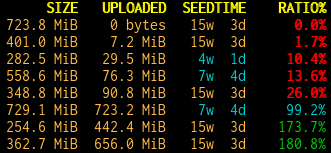
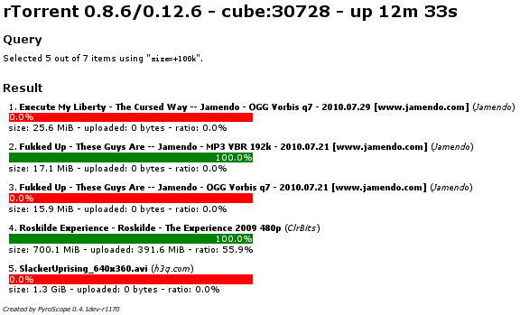
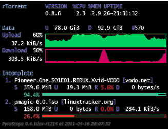

.. included from usage.rst

Introduction
^^^^^^^^^^^^

One of the output formatting options described in the :ref:`rtcontrol-examples`
section are Tempita templates. Compared to the other options, they offer
more versatile formatting because you can use conditionals and loops,
e.g. coloring the output based on some value thresholds (see the example
below). A full description of the Tempita language can be found in its
`documentation <http://pythonpaste.org/tempita/#the-language>`_.

Note that in order for them to be recognized as such, Tempita templates
**MUST** start with two braces ``{{``, use ``{{#}}`` (an empty template
comment) if you want to start the output with some literal text.

Using Tempita to format single items
^^^^^^^^^^^^^^^^^^^^^^^^^^^^^^^^^^^^

The most common form of using Tempita for formatting a single output
item of a ``rtcontrol`` result is probably by defining it in the
configuration as a custom format, so it can be simply used by its name.

The ``colored`` predefined format is a typical example:

.. code-block:: ini

    [FORMATS]

    colored     = {{default ESC = '\x1B'}}{{d.size|sz}} {{d.uploaded|sz}} {{#
        }}{{if d.seedtime < 8*7*86400}}{{ESC}}[36m{{d.seedtime|duration}}{{ESC}}[0m{{else}}{{d.seedtime|duration}}{{endif}}{{#
        }}{{if d.ratio < 0.8}}{{ESC}}[1m{{ESC}}[31m{{elif d.ratio < 1.0}}{{ESC}}[36m{{elif type(d.ratio) is float}}{{ESC}}[32m{{endif}}{{#
        }} {{str(pc(d.ratio)).rjust(8)}}{{chr(37)}}{{if type(d.ratio) is float}}{{ESC}}[0m{{endif}}{{#
        }} {{(d.alias or '').ljust(8)}} {{d.name or ''}}

The main reason to use Tempita here are the if conditions that color the
output depending on threshold values, for the ratio and seed time
columns. Additionally to what Tempita provides, the global namespace of
the template contains the usual format specifiers (see the output of the
``--help-fields`` option), and the current result item as ``d`` (think
**d**\ ownload item).

If you look at some of the if conditions, you might find them peculiar,
especially the ``{{if type(d.ratio) is float}}`` one. This is so that
the column headers, which are obviously not the usual float values but
strings, are exempt from any special coloring. Similarly, the
``{{d.name or ''}}`` caters for the fact that when you use the
``rtcontrol --summary`` option, fields that could normally never
be ``None`` suddenly are — because what's the average of a string,
really?

Notable here is also the use of a named default value ``ESC``, and using
template comments ``{{#}}`` to escape the line endings we don't want to
have in the final output, which looks like this:

Using Tempita for full output control
^^^^^^^^^^^^^^^^^^^^^^^^^^^^^^^^^^^^^

If you use the ``--output-template`` option of ``rtcontrol``, flow
control of presenting the query result is passed fully to a Tempita
template. That means that in addition to iterating over the query
result, you can also show any value available via the rTorrent XMLRPC
connection, since the proxy object that allows access to the client is
passed to the template.

This example shows the output of such a
`template that resembles the rtorstat output <rtorstat.html>`_:

To generate a similar result with your installation, follow these steps
after updating it:

    #. Call ``pyroadmin --create-config`` to copy the
       builtin ``rtorstat.html`` template to your configuration.
    #. Call ``rtcontrol -qO rtorstat.html done=-100 OR xfer=+0 -sdone >/var/www/cron/rtorrent.html``
       to create a HTML page.
    #. Open that page in your browser.

You can add the command from step #2 as a cronjob and always have a
current status display; instead of copying to the local web server
space, you could also put the output into your Dropbox folder to have a
status display on your mobile gear.

The namespace of these templates is populated with the following
objects:

    * ``version`` = the version of PyroScope
    * ``proxy`` = the client proxy (you can call any XMLRPC method on that)
    * ``view`` = the `view <http://packages.python.org/pyrocore/apidocs/pyrocore.torrent.engine.TorrentView-class.html>`_
      that was queried
    * ``query`` = the query conditions
    * ``matches`` = the query result (a list of
      `RtorrentItem <http://packages.python.org/pyrocore/apidocs/pyrocore.torrent.rtorrent.RtorrentItem-class.html>`_ objects)

Running a rtorstat-like template as a cgi-bin
^^^^^^^^^^^^^^^^^^^^^^^^^^^^^^^^^^^^^^^^^^^^^

To get the output of the above example template on-demand, which likely
puts less stress on the system and also gives you current information,
you can add a cgi-bin wrapper to your webserver. We assume a Debian or
Ubuntu Apache standard installation here, and put the cgi-bin into the
file ``/usr/lib/cgi-bin/rtorstat`` with the following content:

.. code-block:: bash

    #! /bin/bash
    echo "Content-Type: text/html; charset=UTF-8"
    echo

    export HOME=/home/bt
    $HOME/bin/rtcontrol -qO rtorstat.html done=-100 OR xfer=+0 -sdone

This will only work if permissions are given to the webserver user (normally
``www-data``) to access the configuration files belonging to the ``bt`` user.
In case you use a ``scgi_local`` connection (i.e. a UNIX domain socket),
this also applies the the XMLRPC socket file.

That can be done by making all things group-readable, and add
``www-data`` to the ``bt`` group. Also, the socket file must be
group-writeable when you use one (TCP sockets are available to all users
on the machine anyway).

Finally, you can put a ``<meta http-equiv="refresh" content="60">`` into
the template to automatically refresh the page every minute.

Adding a rTorrent status display to ``conky``
^^^^^^^^^^^^^^^^^^^^^^^^^^^^^^^^^^^^^^^^^^^^^

You can add a status display to the well-known ``conky`` system monitor
tool by using the `conky rtorstat template`_ together with a matching `conkyrc`_:

To display the example, run these commands, assuming you have conky
already installed:

    #. ``pyroadmin --create-config``
    #. ``conky -c ~/.pyroscope/templates/conky/conkyrc``

If you change the ``execpi`` in the conky configuration to call a
remotely installed ``rtcontrol`` via ``ssh``, you can also beam the
status of a remote rTorrent instance onto your desktop. It is advisable
to increase the poll intervall to at least 15 seconds in that case. Note
that this setup means you have the ``.conkyrc`` on your local host, but
the template used is on the remote host!

::

    ...
    ${execp ssh -o ConnectTimeout=15 -o SetupTimeOut=15 -T REMOTEHOST "~/bin/rtcontrol -qO conky/rtorstat.txt --from-view incomplete is_open=yes is_ignored=no"}

Change ``REMOTEHOST`` to the name of the remote host, and make sure you
have public key login enabled.

Listing all orphans in your download directory
^^^^^^^^^^^^^^^^^^^^^^^^^^^^^^^^^^^^^^^^^^^^^^

This example shows how easily you can use templates to extract some
information out of the client that is otherwise not directly available.
The `orphans.txt`_ template lists all paths in the download directory
*not* loaded into the client, and can be called like this::

    rtcontrol -qO orphans.txt \*

.. _orphans.txt: https://github.com/pyroscope/pyrocore/blob/master/src/pyrocore/data/config/templates/orphans.txt
.. _conkyrc: https://github.com/pyroscope/pyrocore/blob/master/src/pyrocore/data/config/templates/conky/conkyrc
.. _conky rtorstat template: https://github.com/pyroscope/pyrocore/blob/master/src/pyrocore/data/config/templates/conky/rtorstat.txt
.. _rtorstat.html: https://github.com/pyroscope/pyrocore/blob/master/src/pyrocore/data/config/templates/rtorstat.html
